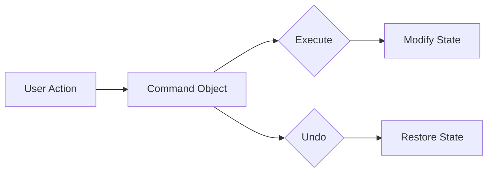

# Undo/Redo Workflow System

A high-performance, full-stack workflow management system featuring a robust **Undo/Redo** engine. Built with Node.js, TypeScript, and Flutter, this project demonstrates advanced architectural patterns used in professional-grade editors and productivity tools.

---

## 🚀 Key Features

- **Infinite Undo/Redo**: Navigate through every state change in your session.
- **Event Sourcing**: Durable command logs ensure history survives application restarts.
- **Atomic Bulk Actions**: Group multiple changes into a single undoable step.
- **Micro-State Persistence**: Partial state snapshots (Memento) allow perfect recovery of deleted data.
- **Dockerized Architecture**: Seamless deployment of backend services.

---

## 🏗️ Architectural Patterns

### 1. Command Pattern
The core of the system. Every user interaction (e.g., editing a document, adding a task) is treated as a **Command Object**.
- **Execution**: The command modifies the current state.
- **Reversal**: Every command encapsulates the logic required to undo itself.


### 2. Memento Pattern (State Capture)
Used primarily in destructive actions like `DeleteTaskCommand`.
- **The Challenge**: When a task is deleted, its data is removed from memory.
- **The Solution**: Before deletion, the command captures a "Memento" (snapshot) of the task. If the user clicks "Undo", the command uses this Memento to re-insert the task exactly where it was.

### 3. Composite Pattern (Bulk Actions)
Allows complex, multi-step operations to be treated as a single unit.
- **Bulk Delete**: When you delete multiple tasks at once, a `CompositeCommand` groups individual `DeleteTaskCommand` objects.
- **Single Click Undo**: One "Undo" triggers the reverse execution of all child commands in the composite.

### 4. Event Sourcing
Instead of just saving the "current state", the system persists the **stream of commands**.
- **Log File**: Every command is serialized to `data/command_log.jsonl`.
- **System Replay**: On startup, the backend reads the log and replays the commands one by one to reconstruct the exactly state the user left off with.

---

## 🛠️ Tech Stack

- **Backend**: Node.js, TypeScript, Express, Jest.
- **Frontend**: Flutter Web.
- **DevOps**: Docker, Docker Compose.
- **Data Format**: JSONL (JSON Lines) for event logs.

---

## 🏁 Getting Started

### Prerequisites
- [Docker & Docker Compose](https://www.docker.com/get-started)
- [Flutter SDK](https://docs.flutter.dev/get-started/install) (for frontend development)

### Deployment

1. **Spin up the Backend**:
   ```bash
   docker-compose up --build
   ```
   *The API will be available at `http://localhost:3000`.*

2. **Launch the Frontend**:
   ```bash
   cd frontend
   flutter run -d chrome
   ```

### Local Development (Backend)
```bash
cd backend
npm install
npm run dev
```

---

## 🧪 Testing

The project includes comprehensive contract tests to ensure that every `execute()` and `undo()` sequence maintains state integrity.
```bash
cd backend
npm test
```

---

## 📜 API Overview

| Endpoint | Method | Description |
| :--- | :--- | :--- |
| `/api/state` | GET | Retrieve current document and task state. |
| `/api/commands/execute` | POST | Send a new action to be executed and logged. |
| `/api/commands/undo` | POST | Reverse the last successful command. |
| `/api/commands/redo` | POST | Re-apply a previously undone command. |
| `/api/history` | GET | View the full stack of recent actions. |

---

## 👥 Authors
- **Jaswanth** - [jaswanth4237](https://github.com/jaswanth4237)
